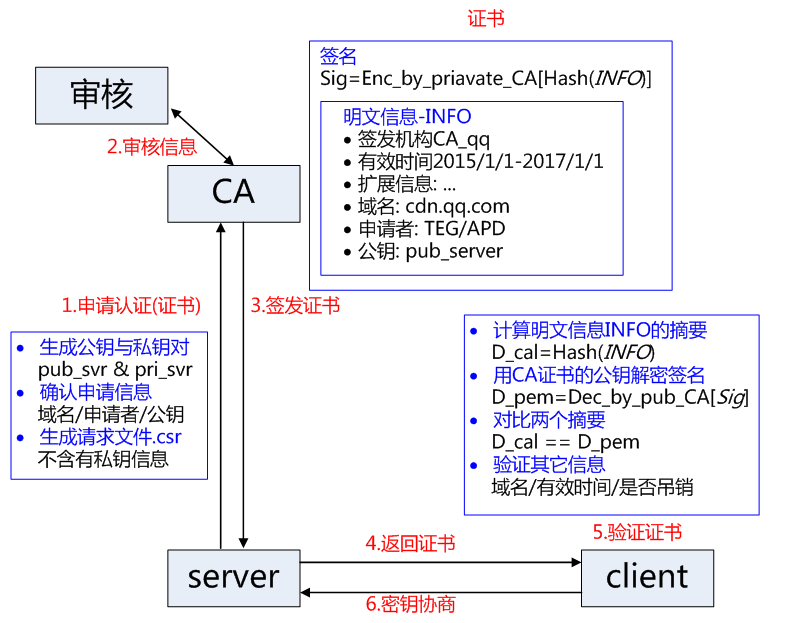

## https简介
    介于HTTP和TCP之间,对HTTP层的消息加密再通过TCP传输,从而实现安全通信,所以叫SSL      

## https使用到的加密技术
1.非对称加密(RSA,DCC,DH),实现密钥交换  
2.对称加密,因非对称加密效率不高,所以使用对称加密对通信数据进行加密解密  
3.HASH签名,验证数据完整性和防止篡改  

## 握手过程
1.浏览器输入地址,例如https://www.baidu.com,回车    
2.(明文传输)浏览器请求baidu服务器,并在请求信息中携带浏览器支持的加密算法,协议版本,压缩算法,随机数  
3.(明文传输)baidu服务器返回协商结果,包含协议版本,加密方式,随机数,服务器证书    
4.(证书校验)  
4.1(证书信息)  
    a. 版本  
    b. 序列号  
    c. 签名算法  
    d. 颁发者  
    e. 有效期  
    f. 使用者  
    g. 公钥  
    f. 指纹(申请证书时,使用CA私钥对明文信息的哈希摘要进行加密,密文即为签名)    

4.2浏览器保存了受信任的证书列表,准备校验该证书,采用同样哈希函数计算明文信息的哈希摘要,然后在利用CA证书  
的公钥对证解密证书中的签名,对比明文摘要和签名的解密结果是否一致,如果一致则判定证书合法(防止中间人攻击),  
接下来再判定证书域名,有效期等    
5.步骤4验证证书通过,则生成随机数字pre-master,,此时浏览器知道用来产生对称加密信息了(两个明文随机和自己产生的pre-master)  
6.change_cipher_spec，客户端通知服务器后续的通信都采用协商的通信密钥和加密算法进行加密通信  
7.encrypted_handshake_message，结合之前所有通信参数的 hash 值与其它相关信息生成一段数据.  
采用协商密钥 session secret 与算法进行加密，然后发送给服务器用于数据与握手验证;  
8.服务器使用私钥解密步骤6浏览器发送来的pre-master数据,结合前面生成的两个随机数,计算得到对称加密密钥  
9.change_cipher_spec, 服务器验证通过之后，服务器同样发送 change_cipher_spec 以告知客户端后续的通信都采用协商的密钥与算法进行加密通信;
10.服务器计算与浏览器先前产生的数据计算hash值,与客户端步骤7发送过来的信息对比,验证密钥正确性,数据一致性  
11.服务器重复浏览器步骤7,encrypted_handshake_message,返回给浏览器,浏览器也再次验证,握手结束  

上面步骤6,7,8,9,10,11完成了对称密钥的生成,和最终握手信息的最后校验,最终完成握手  

## https证书申请

1.证书的私钥不会提交给CA  
2.CA会使用自己的私钥给证书的明文信息hash加密作为签名返回在证书中,浏览器验证时使用CA公钥解密验证  

## 浏览器证书更新
1.Certificate Revocation List,吊销列表,单独的一个文件,包含下次更新列表的时间,所以不是实时更新
2.Online Certificate Status Protocol, 证书状态在线查询协议，一个实时查询证书是否吊销的方式  

## 参考资料
http://www.wosign.com/faq/faq2016-0309-04.htm  