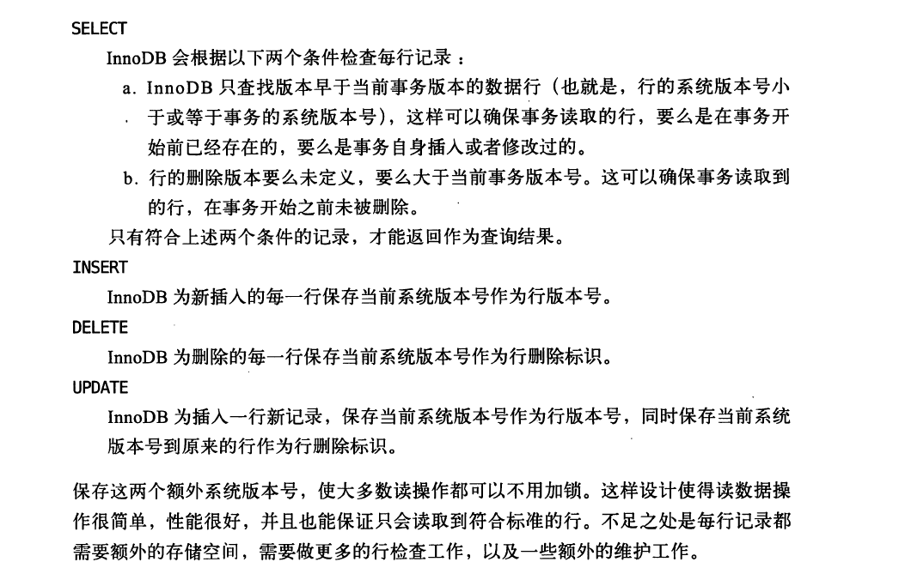

## mysql多版本并发控制(MVCC)
高性能mysql这本书讲到,mysql并不只是实现了行级锁,为了提高并发性还实现了MVCC,MVCC在很多情况下避免加锁  
MVCC通过保存数数据在某个时间点的快照(snapshot)来实现(第一个select statement),每个事务看到的数据是  
一致的,根据事务的开始时间不同,每个事物对同一张表同一时刻看到的数据是不一样的(consistent read)  

### MVCC实现

在使用以上规则测试时,要注意mysql consistent read机制的存在,不然select 返回删除标识小于当前事务ID的记录没法解释  
http://dev.mysql.com/doc/refman/5.7/en/glossary.html#glos_consistent_read  
http://dev.mysql.com/doc/refman/5.7/en/innodb-consistent-read.html  

## consistent read
对于repeatable_read isolate level, the first select create a snapshot of the database state  
对于read_committed isolate level, the snapshot is reset to the time of each consistent read operation.  
读一致性的存在,在事务中不用对其访问的表加锁,其它的事务可以同时更新数据  

当一个事务A创建一个读一致性(执行select),事务B删除一个数据,事务A然后查询仍然能够查询到事务B删除的数据,就像没有被B删除一样  
实现原理就是事务A创建读一致性时,创建了一个当前时间点的数据库快照,而事务B删除数据,会将老的数据写入到undo log中,事务A查询  
数据是返回的undo log中的数据,这类似copyOnWrite,如同linux实现数据快照一样,只有当修改时才修改快照数据,并拷贝原始数据  

## redo log
A disk-based data structure used during crash recovery, to correct data written by incomplete transactions.  
During normal operation, it encodes requests to change InnoDB table data, which result from SQL statements   
or low-level API calls through NoSQL interfaces. Modifications that did not finish updating the data files  
before an unexpected shutdown are replayed automatically.

The redo log is physically represented as a set of files, typically named ib_logfile0 and ib_logfile1.  
The data in the redo log is encoded in terms of records affected; this data is collectively referred to as redo.  
The passage of data through the redo logs is represented by the ever-increasing LSN value. The original 4GB   
limit on maximum size for the redo log is raised to 512GB in MySQL 5.6.3.

The disk layout of the redo log is influenced by the configuration options innodb_log_file_size,   
innodb_log_group_home_dir, and (rarely) innodb_log_files_in_group. The performance of redo log operations is also   
affected by the log buffer, which is controlled by the innodb_log_buffer_size configuration option.

## undo log
A storage area that holds copies of data modified by active transactions. If another transaction needs to see the  
original data (as part of a consistent read operation), the unmodified data is retrieved from this storage area.  

By default, this area is physically part of the system tablespace. In MySQL 5.6 and higher, you can use the   
innodb_undo_tablespaces and innodb_undo_directory configuration options to split it into one or more separate   
tablespace files, the undo tablespaces, optionally stored on another storage device such as an SSD.  

The undo log is split into separate portions, the insert undo buffer and the update undo buffer.  

