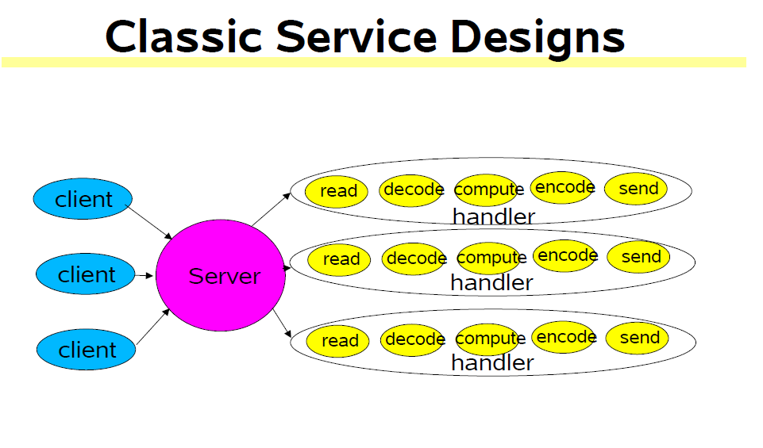
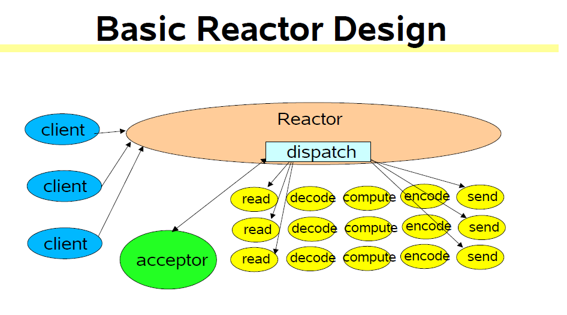
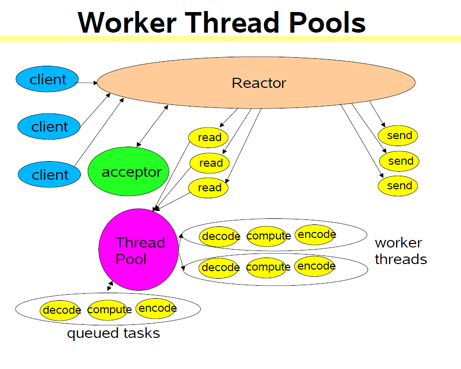

## 可伸缩的java IO
1. 可伸缩的网络服务  
2. 事件却动处理  
3. reactor parttern  
    > 基本版本  
    > 多线程版本  
    > 其它变体  
4. java.nio nonblocking IO APIs

## 网络服务
1. web services, 分布式对象,等等...
2. 网络服务处理流程如下
    1. 读取请求
    2. 解码请求
    3. 逻辑处理
    4. 编码响应  
    5. 发送响应
3. 对于不同的网络请求每一步开销不一样,比如File transfer,Web page generation,computational services  

## 经典的网络服务设计

每个handler可以在单独的线程中运行  

## 可伸缩性目标
1. 当负载增加时优雅的降级
2. 当增加资源(如CPU,memory,disk,bandwidth)时,持续的提高处理能力
3. divide-and-conquer通常是最好的实现可伸缩性目标的方法  

## Reactor Pattern
1. Reactor响应IO事件,分发到对应的handler  
2. Handler执行non-blocking action  
3. 绑定事件和handler

## 多线程设计
1. reactor应当快速触发handler,但是在单线程中handler逻辑处理将使reactor变慢 
2. 将非IO操作交给其它线程 
3. 在多线程reactor中,reactor线程能够使IO饱和  
4. Load-balance to match CPU and IO rates

## worker thread
1. reactor不处理非IO操作将加快reactor thread执行  

## multiple reactor
1. 绑定不同的handler到不同的IO事件,netty使用一个线程接受处理网络连接,几个线程处理网络数据读写  

## 总结
1. reactor模式就是一种事件驱动模式,处理多个输入,然后一个同步的事件分发器,分发事件到对应handler  
2. java nio selector 就是reactor的一种实现  
3. 将各种IO事件,逻辑处理都分别在不同的线程中执行,可提高伸缩性  
